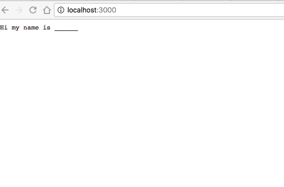
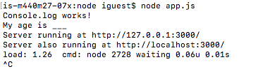
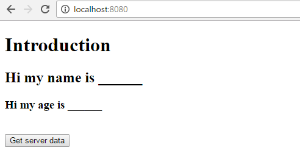

# Integrate Braintree payments with your app
## Using JavaScript (front-end) and Node.js (back-end) 
<br />


## What you will learn:
### (You should already know JavaScript, HTML for the front-end)
* Braintree
* Node.js
* Express

<br />

## Braintree
* a full-stack payments platform for web and mobile applications. 
* It can be integrated into your app to process payments for you with added security and an easy UI.
* They provide a lot of the code for you including the UI (shown below) for users to enter their credit card info and an option to pay through paypal as well.

<br />

## Node.js
* JavaScript runtime environment.
* event-driven framework used to develop I/O intensive and scalable server-side web applications.
* comes with lots of useful modules.
* comes with NPM (node package manager).

<br />

## Express
* the most popular web framework for Node.
* a minimal and flexible Node.js web application framework that provides a robust set of features to develop web and mobile applications.

<br />
<br />


## Setup
### Run these on your command line
### (sudo is not needed if you're using Windows cmd)
1. [Install Node.js and npm](https://nodejs.org/en/)
2. Braintree: `sudo npm install braintree`
3. Express: `sudo npm install express --save`
4. Body parser: `sudo npm install body-parser`
5. Nodemon: `sudo npm install -g nodemon`
6. [Install Allow-Control-Allow-Origin for chrome](https://chrome.google.com/webstore/detail/allow-control-allow-origi/nlfbmbojpeacfghkpbjhddihlkkiljbi?utm_source=gmail)

<br />

## Why do I need to install these?
1. Node.js: back-end for servers built on JavaScript
2. Braintree: package used to integrate payment application
3. Express: web framework used alongside Node.js
4. Body parser: parses incoming request bodies in a middleware before your handlers
5. Nodemon: detects any files changes and automatically restarts your node application.
6. Allow-Control-Allow-Origin: Chrome browser extension allows JavaScript on a web page to make XMLHttpRequests to another domain so you can have the front-end and back-end both running on your local server on different ports.

<br />
<br />

## Learning Exercise 1: Learn Node.js

### Step 1: Create an app.js file

### Step 2: Import require module
Use the require directive to load the http module.
```
var http = require("http");
```

### Step 3: Creating a server
After the require("http") line, we use that created http instance and call http.createServer().
This method creates the  server instance which we will bind to port 3000 using the listen method.
Set whatever you want to return inside response.end(). The console.log() methods are used to show you can print to your command line.
Copy this code inside your app.js file.
```
var http = require("http");

http.createServer(function (request, response) {
   // Send the HTTP header 
   response.writeHead(200, {'Content-Type': 'text/plain'});
   
   // Send the response body as your name
   response.end('Hi my name is ______\n');
}).listen(3000);

// Console will print to the console
console.log('Console.log works!')
console.log('My age is ___')
console.log('Server running at http://127.0.0.1:3000/');
console.log('Server also running at http://localhost:3000/');
```
Now in your command line, run this with `node app.js`. If you have nodemon installed, you can do `nodemon app.js` and it will detect any change you make to the app.js file. On your browser, go to either `http://127.0.0.1:3000/` or `http://localhost:3000/`. This is what you should see:
<kbd></kbd>
<br />
Here is what your terminal should print out. Do `Ctrl + C` to quit if you're using terminal.
<kbd></kbd>
<br />
Now it's your turn. Replace the blank ____'s with your information and test it to see that it works.

<br />

## Learning Exercise 2: Learn Express.js
We will now do the same thing we did for exercise 1 but utilizing Express.js with node.js.

### Step 1: Create an app2.js file

### Step 2: Import require module
Similar to the step 2 in exercise 1, we want to read in express. Make sure you have Express.js installed by doing the npm command listed above in the Setup section.
```
var express = require('express');
```

### Step 3: Creating a server
After the require('express') line, we are setting app = express(), making app an instance of express. This is the standard convention for express apps. Notice the app.get method responds with a GET request with your name.

```
var express = require('express');
var app = express();

app.get('/', function (req, res) {
    res.send('Hi my name is ______\n');
})

var server = app.listen(3000, function () {
    var host = server.address().address
    var port = server.address().port
   
    // Console will print to the console
  console.log('Console.log works!')
  console.log('My age is ___')
  console.log('Server running at http://127.0.0.1:3000/');
  console.log('Server also running at http://localhost:3000/');
})
```
On your server, run node app2.js to run this file and go to your localhost on your browser again. Customize the name and age to yours to complete this exercise.

<br />

## Learning Exercise 3: Connecting Express app with front-end
We will now make a client side file to interact with the Express app we just made in exercise 2. Our front end code will do an AJAX call after the user clicks the button to retrieve data.

### Step 1: Create an index.html file
It doesn't matter where this file is located. It doesn't have to be in the same file as the app2.js because our front-end code will call localhost:3000 to retrive data from app2.js

### Step 2: Create front end with jQuery
The script file could be seperated but we have the html and the JavaScript in the same file for simplicity. Any time the button is clicked, our jQuery does an AJAX call to http://localhost:3000/ to retrieve the data.
```
<!DOCTYPE html>
<html>
  <head>
    <meta charset="UTF-8">
    <script type="text/javascript" src="https://ajax.microsoft.com/ajax/jQuery/jquery-1.4.2.min.js"></script>
    <title>title</title>
  </head>
  <body>
    <h1>Introduction</h1>
    <h2></h2>
    <h3></h3>
    <br />
    <button>Get server data</button>

    <script>
      $(document).ready(function(){
        $("button").click(function(){
            $.get( "http://localhost:3000/", function( data ) {
            $( "h2" ).html( data );
            console.log( "Data retrieved from server" );
          });
        });
    });     
    </script>
  </body>
</html>
```
### Step 3: Testing
Make sure you have the cross-browser Allow-Control-Allow-Origin extension added for chrome. Go up to the Setup section for the link. Now you need two command lines to run app2.js on http://localhost:3000/ and another one to run index.html on another port. The port for index.html does not matter. Let's do `python -m SimpleHTTPServer 8080
` in the folder index.html is located. Before you do that, run `node app2.js` from another command line and it will automatically host it on localhost:3000. If you are on a Mac, do `cmd + t` to open up a new tab on terminal. If you are on Windows, you can try running one on cmd and the other on GitBash or any other CLI you can install.
GO to localhost:8080 on your browser.


### Step 4: Another GET statement
Let's change up app.js and index.html to display your age as well.
Copy this code for app.js. Notice we changed `app.get('/', function (req, res) {` to `app.get('/name', function (req, res) {`
```
var express = require('express');
var app = express();

app.get('/name', function (req, res) {
    res.send('Hi my name is ______\n');
})

app.get('/age', function (req, res) {
    res.send('Hi my age is ______\n');
})

var server = app.listen(3000, function () {
    var host = server.address().address
    var port = server.address().port
   
    // Console will print to the console
  console.log('Console.log works!')
  console.log('My age is ___')
  console.log('Server running at http://127.0.0.1:3000/');
  console.log('Server also running at http://localhost:3000/');
})
```
Now for the index.html, we added another AJAX call.
```
<!DOCTYPE html>
<html>
  <head>
    <meta charset="UTF-8">
    <script type="text/javascript" src="https://ajax.microsoft.com/ajax/jQuery/jquery-1.4.2.min.js"></script>
    <title>title</title>
  </head>
  <body>
    <h1>Introduction</h1>
    <h2></h2>
    <h3></h3>
    <br />
    <button>Get server data</button>

    <script>
      $(document).ready(function(){
        $("button").click(function(){
            $.get( "http://localhost:3000/name", function( data ) {
          $( "h2" ).html( data );
          console.log( "Data retrieved from server" );
        });
        $.get( "http://localhost:3000/age", function( data ) {
          $( "h3" ).html( data );
          console.log( "Data retrieved from server" );
        });
        });
    });     
    </script>
  </body>
</html>
```
This is what you should have:
<kbd></kbd>

<br />
<br />
<br />
<br />

# Braintree integration
## There are 2 main steps
1. Client-side (front-end)
2. Server-side (back-end)

## Client-side steps:
1. Build braintree payment form
2. Request client token from server side (XML format)
3. Embed client token into braintree form.
4. Send payment nounce to server-side

## Server side steps:
1. Generate client token
2. Send client token response to client
3. Receive payment nounce from client-side
4. Create a transaction

## BrainTree vocabulary
**Client token** =  contains all authorization and configuration information your client needs to initialize the client SDK to communicate with Braintree. 
<br />
**Payment nounce** = a one time use value that represents that payment method. On your server, the payment method nonce is used with a Braintree server SDK to charge a card or update a customer's payment methods.

<br />
<br />

# Let's get started!

## Client-side (part 1 / 2)
Create a `index.html` file for your front-end


### Step 1: Build braintree payment form
Copy this code and paste it in. If you want to create a seperate JavaScript file, that's fine.


```
<form id="checkout" method="post" action="/checkout">
  <div id="payment-form"></div>
  <input type="submit" value="Pay $10">
</form>

<script src="https://js.braintreegateway.com/js/braintree-2.30.0.min.js"></script>
<script>
// This is just an initial client token value you can use to test if your UI is working.
// We need to generate a client token on our server, so in step 2,
// we will replace this with an AJAX call that retrieves the client token from your server.
var clientToken = "eyJ2ZXJzaW9uIjoyLCJhdXRob3JpemF0aW9uRmluZ2VycHJpbnQiOiIzNWI2NjMwOGNkYjM1MjFjZWY3MTI0ZTZkOGI2YTQwOTMzMjA2YTcwYjc5OTY0OTVkMzI3ZWI1MTkwZjdjYjNkfGNyZWF0ZWRfYXQ9MjAxNi0xMS0yMVQwMDo1MDozNS44MTMyMjU0MTYrMDAwMFx1MDAyNm1lcmNoYW50X2lkPTM0OHBrOWNnZjNiZ3l3MmJcdTAwMjZwdWJsaWNfa2V5PTJuMjQ3ZHY4OWJxOXZtcHIiLCJjb25maWdVcmwiOiJodHRwczovL2FwaS5zYW5kYm94LmJyYWludHJlZWdhdGV3YXkuY29tOjQ0My9tZXJjaGFudHMvMzQ4cGs5Y2dmM2JneXcyYi9jbGllbnRfYXBpL3YxL2NvbmZpZ3VyYXRpb24iLCJjaGFsbGVuZ2VzIjpbXSwiZW52aXJvbm1lbnQiOiJzYW5kYm94IiwiY2xpZW50QXBpVXJsIjoiaHR0cHM6Ly9hcGkuc2FuZGJveC5icmFpbnRyZWVnYXRld2F5LmNvbTo0NDMvbWVyY2hhbnRzLzM0OHBrOWNnZjNiZ3l3MmIvY2xpZW50X2FwaSIsImFzc2V0c1VybCI6Imh0dHBzOi8vYXNzZXRzLmJyYWludHJlZWdhdGV3YXkuY29tIiwiYXV0aFVybCI6Imh0dHBzOi8vYXV0aC52ZW5tby5zYW5kYm94LmJyYWludHJlZWdhdGV3YXkuY29tIiwiYW5hbHl0aWNzIjp7InVybCI6Imh0dHBzOi8vY2xpZW50LWFuYWx5dGljcy5zYW5kYm94LmJyYWludHJlZWdhdGV3YXkuY29tLzM0OHBrOWNnZjNiZ3l3MmIifSwidGhyZWVEU2VjdXJlRW5hYmxlZCI6dHJ1ZSwicGF5cGFsRW5hYmxlZCI6dHJ1ZSwicGF5cGFsIjp7ImRpc3BsYXlOYW1lIjoiQWNtZSBXaWRnZXRzLCBMdGQuIChTYW5kYm94KSIsImNsaWVudElkIjpudWxsLCJwcml2YWN5VXJsIjoiaHR0cDovL2V4YW1wbGUuY29tL3BwIiwidXNlckFncmVlbWVudFVybCI6Imh0dHA6Ly9leGFtcGxlLmNvbS90b3MiLCJiYXNlVXJsIjoiaHR0cHM6Ly9hc3NldHMuYnJhaW50cmVlZ2F0ZXdheS5jb20iLCJhc3NldHNVcmwiOiJodHRwczovL2NoZWNrb3V0LnBheXBhbC5jb20iLCJkaXJlY3RCYXNlVXJsIjpudWxsLCJhbGxvd0h0dHAiOnRydWUsImVudmlyb25tZW50Tm9OZXR3b3JrIjp0cnVlLCJlbnZpcm9ubWVudCI6Im9mZmxpbmUiLCJ1bnZldHRlZE1lcmNoYW50IjpmYWxzZSwiYnJhaW50cmVlQ2xpZW50SWQiOiJtYXN0ZXJjbGllbnQzIiwiYmlsbGluZ0FncmVlbWVudHNFbmFibGVkIjp0cnVlLCJtZXJjaGFudEFjY291bnRJZCI6ImFjbWV3aWRnZXRzbHRkc2FuZGJveCIsImN1cnJlbmN5SXNvQ29kZSI6IlVTRCJ9LCJjb2luYmFzZUVuYWJsZWQiOmZhbHNlLCJtZXJjaGFudElkIjoiMzQ4cGs5Y2dmM2JneXcyYiIsInZlbm1vIjoib2ZmIn0=";

braintree.setup(clientToken, "dropin", {
  container: "payment-form"
});
</script>
```
Run this code and see if the UI is displayed on the front-end. If the client token isn't valid, it will not show up so make sure your client token value is valid. The UI should like this:
<kbd></kbd>


### Step 2:  Request client token from server side (XML format)
We will use jQuery to do an AJAX request to your server-side code (which will be created next).
<br />
For now, we will do a request to our localhost:3001 port to test it. When we create our back-end code,
we need to make sure we host on the same port, localhost:3001.
```
var clientToken;
$.ajax({url: "http://localhost:3001/client_token",
		success: function(result) {
        	console.log(result);
        	clientToken = result;
        }});
```


### Step 3:  Embed client token into braintree form
```
braintree.setup(CLIENT_TOKEN_FROM_SERVER, 'dropin', {
  container: 'payment-form'
});
```


### Combining Steps 2 and 3
You need to build the form within the AJAX request.
```
var clientToken;
// ajax request to recieve client token
$.ajax({url: "http://localhost:3001/client_token",
		success: function(result) {
        	console.log(result);
        	clientToken = result;

        	// embedding the client token into the braintree template
         	braintree.setup(clientToken, "dropin", {
			    container: "payment-form"
		    });
        }});

```


### Step 4:  Send payment nounce to server-side
The payment nounce is automatically recieved when the client submits the form and it is automatically sent to the server side. In the server side, the payment nounce will be used to create a transaction. We will not be needing any more code written in the client side.

### Client side complete code
```
<form id="checkout" method="post" action="/checkout">
  <div id="payment-form"></div>
  <input type="submit" value="Pay $10">
</form>

<script src="https://ajax.googleapis.com/ajax/libs/jquery/3.1.1/jquery.min.js"></script>
<script src="https://js.braintreegateway.com/js/braintree-2.29.0.min.js"></script>

<script>

// AJAX call to retrieve client token from server
var clientToken;
$.ajax({url: "http://localhost:3001/client_token",
    success: function(result) {
          console.log(result);
          clientToken = result;

          // embedding the client token into the braintree template
          braintree.setup(clientToken, "dropin", {
        container: "payment-form"
      });
        }});
</script>
```

<br />

## Server-side (part 2 / 2)
Create a `app.js` file. It doesn't have to be in the same folder as the index.html, but you will need to run both on different local servers to test your code. Make sure to install the Allow-Control-Allow-Origin for chrome (link provided at the top under Setup)

### Step 0: Setting up our Node file
Make sure we have all packages and dependencies installed. Go back to Setup to see the commands to npm install braintree and express. Then copy and paste the code below so our app.js file loads these packages.
```
var braintree = require("braintree");
var express = require('express');
var app = express();

```
And go make a free Sandbox account on braintreepayments.com to get your API credentials. Once you sign up, go to Account tab > My User > under API Keys, Tokenization Keys, Encryption Keys, click View Authorizations. Once you get your API key for node.js, just copy and paste that in your server-side code. It should look something like this:
```
// configure API credentials
var gateway = braintree.connect({
  environment: braintree.Environment.Sandbox,
  merchantId: "d7b6q5dgx6hdjhhw",
  publicKey: "mmjpwtk9k5mmvswv",
  privateKey: "dc0774e8ea6663588750b7993e4cf1c0"
});
```

### Step 1 & 2: Generate client token and send it to client side
Include this code after your API credentials in app.js

```
app.get("/client_token", function (req, res) {
  gateway.clientToken.generate({}, function (err, response) {
    res.send(response.clientToken);
  });
});
```
If the client tries to do an AJAX request for "http://localhost:3001/client_token", it should recieve the client token. Test this by running app.js under your local port 3001, and your index.html on another port. It doesn't matter what port index.html is running in as long as it's different.

### Step 3 & 4: Receive payment nounce from client-side and create a transaction with it
Paste this code under the one generating the client token.
```
app.post("/checkout", function (req, res) { 
  // recieve payment method nounce from client
  var nonceFromTheClient = req.body.payment_method_nonce;
  console.log(nonceFromTheClient);

   //creating a transaction
  gateway.transaction.sale({
    amount: "10.00",
    paymentMethodNonce: nonceFromTheClient,
    options: {
      submitForSettlement: true
    }
  }, function (err, result) {
    console.log("Success!");
  });
});
```
Here your server recieves the payment nounce from the client, then sends that to Braintree's servers to complete the transaction. The amount created here was $10 but you may use the bodyparser to change it. For any of this to work, you will need to do app.listen. Add this code to the end:
```
app.listen(3001, function () {
  console.log('listening on port 3001!')
})
```
### Server side complete code
```
var braintree = require("braintree");
var express = require('express');
var app = express();

// configure API credentials
var gateway = braintree.connect({
  environment: braintree.Environment.Sandbox,
  merchantId: "d7b6q5dgx6hdjhhw",
  publicKey: "mmjpwtk9k5mmvswv",
  privateKey: "dc0774e8ea6663588750b7993e4cf1c0"
});

// generate a client token
// include customerId for returning customers
app.get("/client_token", function (req, res) {
  gateway.clientToken.generate({}, function (err, response) {
    res.send(response.clientToken);
  });
});

// recieve payment method nounce from client
app.post("/checkout", function (req, res) { 
  var nonceFromTheClient = req.body.payment_method_nonce;
  console.log(nonceFromTheClient);

   //creating a transaction
  gateway.transaction.sale({
    amount: "10.00",
    paymentMethodNonce: nonceFromTheClient,
    options: {
      submitForSettlement: true
    }
  }, function (err, result) {
    console.log("Success!");
  });
});


app.listen(3001, function () {
  console.log('listening on port 3001!')
})
```


