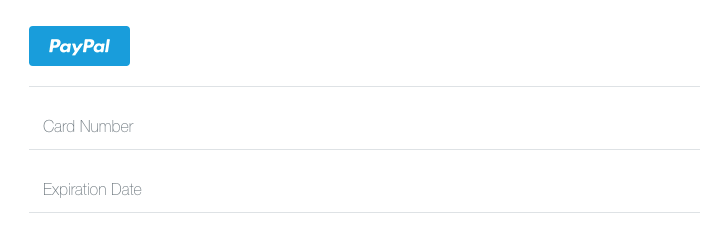

# Integrate Braintree payments with your app
## Using JavaScript (front-end) and Node.js (back-end) 
<br />


## What you will learn:
### (You should already know JavaScript, HTML for the front-end)
* Braintree
* Node.js
* Express

<br />

## Braintree
* a full-stack payments platform for web and mobile applications. 
* It can be integrated into your app to process payments for you with added security and an easy UI.
* They provide a lot of the code for you including the UI (shown below) for users to enter their credit card info and an option to pay through paypal as well.


<br />

## Node.js
* JavaScript runtime environment.
* event-driven framework used to develop I/O intensive and scalable server-side web applications.
* comes with lots of useful modules.
* comes with NPM (node package manager).

<br />

## Express
* the most popular web framework for Node.
* a minimal and flexible Node.js web application framework that provides a robust set of features to develop web and mobile applications.

<br />
<br />


## Setup
### Run these on your command line
### (sudo is not needed if you're using Windows cmd)
1. [Install Node.js and npm](https://nodejs.org/en/)
2. Braintree: `sudo npm install braintree`
3. Express: `sudo npm install express --save`
4. Body parser: `sudo npm install body-parser`
5. Nodemon: `sudo npm install -g nodemon`
6. [Install Allow-Control-Allow-Origin for chrome](https://chrome.google.com/webstore/detail/allow-control-allow-origi/nlfbmbojpeacfghkpbjhddihlkkiljbi?utm_source=gmail)

<br />

## Why do I need to install these?
1. Node.js: back-end for servers built on JavaScript
2. Braintree: package used to integrate payment application
3. Express: web framework used alongside Node.js
4. Body parser: parses incoming request bodies in a middleware before your handlers
5. Nodemon: detects any files changes and automatically restarts your node application.
6. Allow-Control-Allow-Origin: allows JavaScript on a web page to make XMLHttpRequests to another domain so you can have the front-end and back-end both running on your local server on different ports.

<br />
<br />

# There are 2 main steps to complete Braintree integration
1. Client-side (front-end)
2. Server-side (back-end)

## Client-side steps:
1. Build braintree payment form
2. Request client token from server side (XML format)
3. Embed client token into braintree form.
4. Receive payment nounce from Braintree when client submits form (auto)
5. Send payment nounce to server-side
6. Reroute client back to homepage

## Server side steps:
1. Generate client token
2. Send client token response to client
3. Receive payment nounce from client-side
4. Create a transaction

## Vocabulary
**Client token** =  contains all authorization and configuration information your client needs to initialize the client SDK to communicate with Braintree. 
<br />
**Payment nounce** = a one time use value that represents that payment method.

<br />
<br />

# Let's get started!

## Client-side (part 1 / 2)

`1. Build braintree payment form`


```
<form id="checkout" method="post" action="/checkout">
  <div id="payment-form"></div>
  <input type="submit" value="Pay $10">
</form>

<script src="https://js.braintreegateway.com/js/braintree-2.30.0.min.js"></script>
<script>
// We generated a client token for you so you can test out this code
// immediately. In a production-ready integration, you will need to
// generate a client token on your server (see section below).
var clientToken = "eyJ2ZXJzaW9uIjoyLCJhdXRob3JpemF0aW9uRmluZ2VycHJpbnQiOiIzNWI2NjMwOGNkYjM1MjFjZWY3MTI0ZTZkOGI2YTQwOTMzMjA2YTcwYjc5OTY0OTVkMzI3ZWI1MTkwZjdjYjNkfGNyZWF0ZWRfYXQ9MjAxNi0xMS0yMVQwMDo1MDozNS44MTMyMjU0MTYrMDAwMFx1MDAyNm1lcmNoYW50X2lkPTM0OHBrOWNnZjNiZ3l3MmJcdTAwMjZwdWJsaWNfa2V5PTJuMjQ3ZHY4OWJxOXZtcHIiLCJjb25maWdVcmwiOiJodHRwczovL2FwaS5zYW5kYm94LmJyYWludHJlZWdhdGV3YXkuY29tOjQ0My9tZXJjaGFudHMvMzQ4cGs5Y2dmM2JneXcyYi9jbGllbnRfYXBpL3YxL2NvbmZpZ3VyYXRpb24iLCJjaGFsbGVuZ2VzIjpbXSwiZW52aXJvbm1lbnQiOiJzYW5kYm94IiwiY2xpZW50QXBpVXJsIjoiaHR0cHM6Ly9hcGkuc2FuZGJveC5icmFpbnRyZWVnYXRld2F5LmNvbTo0NDMvbWVyY2hhbnRzLzM0OHBrOWNnZjNiZ3l3MmIvY2xpZW50X2FwaSIsImFzc2V0c1VybCI6Imh0dHBzOi8vYXNzZXRzLmJyYWludHJlZWdhdGV3YXkuY29tIiwiYXV0aFVybCI6Imh0dHBzOi8vYXV0aC52ZW5tby5zYW5kYm94LmJyYWludHJlZWdhdGV3YXkuY29tIiwiYW5hbHl0aWNzIjp7InVybCI6Imh0dHBzOi8vY2xpZW50LWFuYWx5dGljcy5zYW5kYm94LmJyYWludHJlZWdhdGV3YXkuY29tLzM0OHBrOWNnZjNiZ3l3MmIifSwidGhyZWVEU2VjdXJlRW5hYmxlZCI6dHJ1ZSwicGF5cGFsRW5hYmxlZCI6dHJ1ZSwicGF5cGFsIjp7ImRpc3BsYXlOYW1lIjoiQWNtZSBXaWRnZXRzLCBMdGQuIChTYW5kYm94KSIsImNsaWVudElkIjpudWxsLCJwcml2YWN5VXJsIjoiaHR0cDovL2V4YW1wbGUuY29tL3BwIiwidXNlckFncmVlbWVudFVybCI6Imh0dHA6Ly9leGFtcGxlLmNvbS90b3MiLCJiYXNlVXJsIjoiaHR0cHM6Ly9hc3NldHMuYnJhaW50cmVlZ2F0ZXdheS5jb20iLCJhc3NldHNVcmwiOiJodHRwczovL2NoZWNrb3V0LnBheXBhbC5jb20iLCJkaXJlY3RCYXNlVXJsIjpudWxsLCJhbGxvd0h0dHAiOnRydWUsImVudmlyb25tZW50Tm9OZXR3b3JrIjp0cnVlLCJlbnZpcm9ubWVudCI6Im9mZmxpbmUiLCJ1bnZldHRlZE1lcmNoYW50IjpmYWxzZSwiYnJhaW50cmVlQ2xpZW50SWQiOiJtYXN0ZXJjbGllbnQzIiwiYmlsbGluZ0FncmVlbWVudHNFbmFibGVkIjp0cnVlLCJtZXJjaGFudEFjY291bnRJZCI6ImFjbWV3aWRnZXRzbHRkc2FuZGJveCIsImN1cnJlbmN5SXNvQ29kZSI6IlVTRCJ9LCJjb2luYmFzZUVuYWJsZWQiOmZhbHNlLCJtZXJjaGFudElkIjoiMzQ4cGs5Y2dmM2JneXcyYiIsInZlbm1vIjoib2ZmIn0=";

braintree.setup(clientToken, "dropin", {
  container: "payment-form"
});
</script>
```


